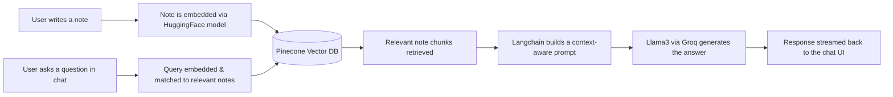

<div align="center">

# 🧠 Memomind

### AI-Powered, Chat-Based Note-Taking with RAG

Capture your thoughts, then *talk* to them. Memomind turns your notes into a searchable knowledge base you can chat with — powered by Retrieval-Augmented Generation, Llama3, and vector search.

[](https://nextjs.org/)
[](https://react.dev/)
[](https://www.typescriptlang.org/)
[](https://tailwindcss.com/)
[](https://ui.shadcn.com/)
[](https://www.langchain.com/)
[](https://ai.meta.com/llama/)
[](https://clerk.com/)
[](#-license)

[🚀 Live Demo](https://memomind-ai-chatbot.vercel.app) · [🐛 Report a Bug](https://github.com/rooneyrulz/memomind-ai-chatbot/issues) · [✨ Request a Feature](https://github.com/rooneyrulz/memomind-ai-chatbot/issues)

</div>

---

## 📖 Overview

**Memomind** is a sleek, modern note-taking application that reimagines how you interact with your own knowledge. Instead of scrolling through endless notes, you simply **ask**. Under the hood, Memomind indexes your notes into a vector database and uses a **Retrieval-Augmented Generation (RAG)** pipeline to fetch the most relevant context before generating an AI-powered answer — grounded in *your own content*, not generic web knowledge.

Whether you're journaling, keeping meeting notes, or building a personal wiki, Memomind gives you a conversational layer on top of everything you've written.

---

## ✨ Features

- 💬 **Chat-Based RAG Workflow** — Ask natural-language questions and get answers synthesized from your own notes.
- 🤖 **AI-Powered Insights** — Summaries, connections, and context surfaced automatically via Langchain + Llama3 (served through Groq's fast inference).
- 🔐 **Secure Authentication** — User accounts, sessions, and route protection handled by Clerk.
- 🧩 **Vector Search** — Notes are embedded (HuggingFace embeddings) and stored in a vector database (Pinecone) for fast semantic retrieval.
- 🗄️ **Persistent Storage** — Structured data managed with Prisma ORM on MongoDB Atlas.
- 🎨 **Modern, Responsive UI** — Built with Tailwind CSS and Shadcn/ui for a clean, accessible experience across devices.
- ✅ **Type-Safe Forms** — React Hook Form + Zod for robust, validated inputs end-to-end.
- ⚡ **Next.js 14 App Router** — Server components, streaming, and optimized routing out of the box.

---

## 🛠️ Tech Stack

| Layer | Technology |
| --- | --- |
| **Framework** | [Next.js 14](https://nextjs.org/) (App Router), [React 18](https://react.dev/) |
| **Language** | [TypeScript](https://www.typescriptlang.org/) |
| **Styling / UI** | [Tailwind CSS](https://tailwindcss.com/), [Shadcn/ui](https://ui.shadcn.com/) |
| **Auth** | [Clerk](https://clerk.com/) |
| **AI / LLM Orchestration** | [Langchain](https://www.langchain.com/), [Llama3](https://ai.meta.com/llama/) via [Groq](https://groq.com/), [OpenAI](https://openai.com/) |
| **Embeddings** | [HuggingFace Embeddings](https://huggingface.co/) |
| **Vector Database** | [Pinecone](https://www.pinecone.io/) |
| **Database / ORM** | [MongoDB Atlas](https://www.mongodb.com/atlas), [Prisma](https://www.prisma.io/) |
| **Forms & Validation** | [React Hook Form](https://react-hook-form.com/), [Zod](https://zod.dev/) |
| **Deployment** | [Vercel](https://vercel.com/) |

---

## 🧭 How It Works



1. **Write** — Create and organize notes in a clean editor.
2. **Embed** — Each note is converted into a vector embedding and stored in Pinecone.
3. **Ask** — Type a question into the chat interface.
4. **Retrieve** — The most semantically relevant notes are pulled from the vector store.
5. **Generate** — Langchain assembles the retrieved context into a prompt for Llama3 (served via Groq), producing a grounded, accurate answer.

---

## 📂 Project Structure

```
memomind-ai-chatbot/
├── prisma/            # Prisma schema & database models
├── public/            # Static assets (images, icons, etc.)
├── src/               # Application source code
│   ├── app/           # Next.js App Router pages & API routes
│   ├── components/    # Shadcn/ui + custom React components
│   ├── lib/           # Langchain, embeddings & utility helpers
│   └── ...
├── components.json    # Shadcn/ui configuration
├── tailwind.config.ts # Tailwind CSS configuration
├── next.config.mjs    # Next.js configuration
└── package.json       # Dependencies & scripts
```

---

## 🚀 Getting Started

### Prerequisites

- **Node.js** ≥ 18.x
- A package manager: `npm`, `yarn`, `pnpm`, or `bun`
- Accounts / API keys for the services below

### 1. Clone the repository

```bash
git clone https://github.com/rooneyrulz/memomind-ai-chatbot.git
cd memomind-ai-chatbot
```

### 2. Install dependencies

```bash
npm install
# or
yarn install
# or
pnpm install
```

### 3. Configure environment variables

Create a `.env` file in the project root. At minimum, you'll need credentials for authentication, your database, and your AI/vector services, e.g.:

```env
# Database
DATABASE_URL=

# Clerk Authentication
NEXT_PUBLIC_CLERK_PUBLISHABLE_KEY=
CLERK_SECRET_KEY=

# LLM / Inference
GROQ_API_KEY=
OPENAI_API_KEY=

# Embeddings
HUGGINGFACE_API_KEY=

# Vector Database
PINECONE_API_KEY=
PINECONE_INDEX=
```

> ⚠️ Check `package.json` / the codebase for the exact variable names expected by each integration, since these may evolve over time.

### 4. Set up the database

```bash
npx prisma generate
npx prisma db push
```

### 5. Run the development server

```bash
npm run dev
# or
yarn dev
# or
pnpm dev
```

Open [http://localhost:3000](http://localhost:3000) in your browser to see Memomind in action.

---

## 🌐 Deployment

Memomind is optimized for deployment on **[Vercel](https://vercel.com/)**, the platform built by the creators of Next.js.

[](https://vercel.com/new)

A live version of the app is already deployed here:
👉 **[memomind-ai-chatbot.vercel.app](https://memomind-ai-chatbot.vercel.app)**

Refer to the [Next.js deployment docs](https://nextjs.org/docs/deployment) for platform-specific guidance.

---

## 🗺️ Roadmap Ideas

- [ ] Multi-format note import (Markdown, PDF, etc.)
- [ ] Shareable / collaborative notebooks
- [ ] Voice-to-note transcription
- [ ] Note tagging & smart folders
- [ ] Export chat conversations as summaries

> Have an idea? Open a [feature request](https://github.com/rooneyrulz/memomind-ai-chatbot/issues) — see the contribution guide below!

---

## 🤝 Collaboration & Contributing

Contributions of all kinds are welcome — bug fixes, new features, documentation, or design improvements!

1. **Fork** the repository
2. **Create a branch** for your change

   ```bash
   git checkout -b feature/your-feature-name
   ```

3. **Make your changes**, following the existing code style (TypeScript + ESLint + Prettier configs are included)
4. **Commit** with a clear, descriptive message

   ```bash
   git commit -m "feat: add note tagging support"
   ```

5. **Push** to your fork

   ```bash
   git push origin feature/your-feature-name
   ```

6. **Open a Pull Request** against the `main` branch, describing what you changed and why

### Guidelines

- Keep PRs focused — one feature/fix per PR is easier to review.
- Run `npm run lint` before submitting to catch formatting/lint issues.
- Add comments for non-obvious logic, especially around the RAG/embedding pipeline.
- Be respectful and constructive in code reviews and discussions.

If you're new to open source, check out [GitHub's guide to contributing](https://docs.github.com/en/get-started/quickstart/contributing-to-projects) — first-time contributors are very welcome here.

---

## 🆘 Support

Need help or found something broken?

- 🐛 **Bugs & Issues** — [Open an issue](https://github.com/rooneyrulz/memomind-ai-chatbot/issues) with steps to reproduce, expected vs. actual behavior, and screenshots if relevant.
- 💡 **Feature Requests** — [Open an issue](https://github.com/rooneyrulz/memomind-ai-chatbot/issues) tagged as an enhancement.
- 🔀 **Pull Requests** — Check [open PRs](https://github.com/rooneyrulz/memomind-ai-chatbot/pulls) to avoid duplicate work before starting something new.
- ⭐ **Show Support** — If Memomind is useful to you, consider starring the repo — it helps others discover the project!

---

<div align="center">

Built with ❤️ by [rooneyrulz](https://github.com/rooneyrulz)

</div>
